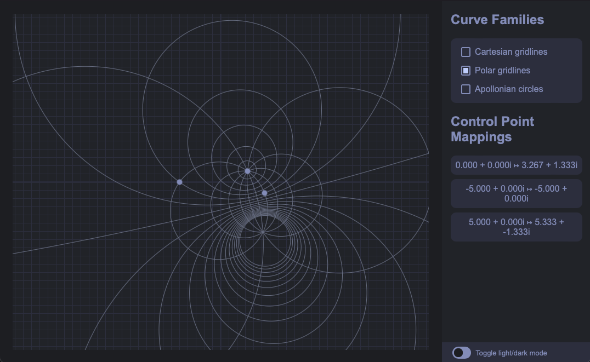

# Möbius Transformations

A [Möbius Transformation](https://en.wikipedia.org/wiki/M%C3%B6bius_transformation)
(also called a linear fractional transformation)
is a globally conformal mapping of a the extended complex plane onto itself.

Möbius transformations have the property that circles and lines
(which can be thought of as circles with infinite radius) are mapped to other circles/lines.

This is a small desktop application made to visualize the action of such transformations.
A Möbius transformation is uniquely determined by its action on 3 points,
so 3 "control points" are provided by which the transformation can be manipulated and
the resulting deformation of the contour lines observed.

The application is built using the [Tauri framework](https://tauri.app/)
and leveraging [React](https://react.dev/) + [Vite](https://vitejs.dev/) to drive the frontend,
primarily as a pedagogical exercise.
